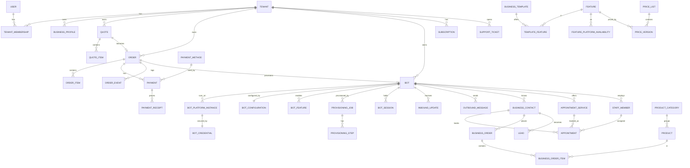

# DATABASE

Status: **Phase 0 — schema design** · PostgreSQL 16 + pgvector · Last updated: 2026-08-10

Conventions:

- Primary keys: `BIGSERIAL` internally; every externally exposed entity also has a
  `public_id UUID` (unique, indexed). **APIs and URLs use `public_id` only** — sequential
  IDs leak volume and enable enumeration.
- Timestamps: `TIMESTAMPTZ`, always UTC. `created_at` / `updated_at` on every table.
- Money: `amount_minor BIGINT` + `currency CHAR(3)`. Never `FLOAT`, never a bare decimal
  without its currency.
- Tenant scoping: every tenant-owned table has `tenant_id` **NOT NULL** and a composite
  index leading with `tenant_id`.
- Soft delete only where auditing requires it (`deleted_at`); otherwise hard delete.
- Enums as `VARCHAR` + `CHECK`/Django choices (not PG enums — migrations are painful).
- JSONB is used *only* for genuinely open-ended config (`config`, `payload`, `metadata`),
  never as a substitute for relations.

---

## 1. Domain map



---

## 2. Identity & tenancy

**`user`** — `public_id`, `email` (citext, unique), `password`, `is_staff`,
`is_superuser`, `preferred_locale`, `preferred_currency`, `timezone`, `phone`,
`phone_verified_at`, `last_login_ip`, timestamps.

**`staff_role`** / **`user_staff_role`** — RBAC for platform staff (§55):
`SUPER_ADMIN`, `ADMIN`, `SUPPORT_AGENT`, `FINANCE_AGENT`, `BOT_OPS_AGENT`. Permissions are
a JSONB set of scope strings resolved at request time.

**`tenant`** — the customer organisation. `public_id`, `name`, `country`, `default_locale`,
`default_currency`, `timezone`, `status` (`ACTIVE|SUSPENDED|CLOSED`), `created_by_user_id`.

**`tenant_membership`** — `tenant_id`, `user_id`, `role` (`OWNER|MANAGER|STAFF`),
`permissions JSONB`, `invited_by`, `accepted_at`.
Unique `(tenant_id, user_id)`.

**`channel_identity`** — cross-channel linking (§47). `user_id`, `platform`
(`telegram|bale`), `platform_user_id`, `username`, `linked_at`, `link_nonce_used`.
Unique `(platform, platform_user_id)`.

**`identity_link_nonce`** — `nonce` (unique), `user_id`, `expires_at`, `consumed_at`,
`created_ip`. Single-use, ≤10 min TTL.

---

## 3. Catalogue & pricing

**`business_template`** — `slug` (unique), `icon`, `is_active`, `sort_order`,
`default_locale_content` via translations. Seeded: doctor, clinic, beauty, restaurant,
shop, academy, real_estate, service, generic.

**`feature`** — `slug` (unique), `category`, `icon`, `manifest_version`, `is_active`,
`requires JSONB` (slugs), `config_schema_version`.

**`template_feature`** — `template_id`, `feature_id`, `is_default`, `is_required`,
`sort_order`. Unique `(template_id, feature_id)`.

**`feature_platform_availability`** — `feature_id`, `platform`, `is_available`,
`degradation_note`. Drives what the builder is allowed to sell (analysis R-02).

**`currency`** — `code` (PK, ISO-4217 or `USDT`), `exponent`, `symbol`,
`display_unit` (e.g. `TOMAN` for IRR), `display_divisor`, `is_active`.

**`price_list`** — `slug`, `currency`, `country_scope`, `is_active`.
One list per currency; no runtime FX.

**`price_version`** — **immutable**. `price_list_id`, `price_key`
(e.g. `feature.appointment.setup`, `platform.telegram.base`, `platform.multi.surcharge`,
`template.clinic.base`), `amount_minor`, `billing_kind` (`ONE_TIME|RECURRING_MONTHLY`),
`valid_from`, `valid_to NULL`, `created_by`. Unique partial index on
`(price_list_id, price_key)` where `valid_to IS NULL` — exactly one live price per key.

> Price changes insert a new row and close the old one. Nothing is ever updated. This is
> what makes spec §12's "old orders still show $10" true by construction.

---

## 4. Quotes & orders

> **`quote` is the one deliberate exception to the tenancy rule.** The builder must work
> before registration (spec §44), so a quote starts anonymous, owned by an unguessable
> `public_id` plus a session token, and is bound to a tenant only by `POST /quotes/{id}/claim/`.
> It is therefore **not** a `TenantOwnedModel`. Once `tenant_id` is set it is immutable, and
> every downstream object (`order`, `bot`, …) *is* tenant-owned in the normal way.

**`quote`** — `public_id`, `tenant_id NULL` (anonymous builder allowed),
`created_via` (`WEB|TELEGRAM_BUILDER|BALE_BUILDER`), `template_id`, `platforms TEXT[]`,
`selected_features JSONB`, `business_draft JSONB`, `currency`, `subtotal_minor`,
`discount_minor`, `tax_minor`, `total_minor`, `expires_at`, `converted_order_id NULL`.

**`quote_item`** — `quote_id`, `price_key`, `price_version_id`, `label_key`,
`unit_amount_minor`, `quantity`, `amount_minor`, `billing_kind`.

**`order`** — `public_id`, `number` (human, unique, e.g. `10042`), `tenant_id`,
`quote_id`, `status`, `currency`, `subtotal_minor`, `discount_minor`, `tax_minor`,
`total_minor`, `locale`, `created_via`, `template_id`, `platforms TEXT[]`,
`provisioning_strategy`, `placed_at`, `paid_at`, `activated_at`, `cancelled_at`.
Indexes: `(tenant_id, status)`, `(status, created_at)`, `number`.

**`order_item`** — `order_id`, `price_key`, `price_version_id`, `label_key`,
`unit_amount_minor`, `quantity`, `amount_minor`, `billing_kind`, `feature_id NULL`,
`snapshot JSONB` (full price + feature metadata at purchase time).

**`order_event`** — append-only transition log: `order_id`, `from_status`, `to_status`,
`actor_type` (`CUSTOMER|STAFF|SYSTEM`), `actor_id`, `reason`, `metadata JSONB`, `created_at`.

> **Discounts.** `discount_minor` is an **admin-applied manual adjustment** in v1, recorded
> with `discount_reason` and audit-logged. Coupon codes, campaigns and automatic promotions
> are explicitly out of scope — the column exists so adding them later is additive.

### Order state machine (spec §19)

```
DRAFT ──► PENDING_PAYMENT ──► RECEIPT_SUBMITTED ──► PAYMENT_REVIEW
                                                      │      │
                                     PAYMENT_REJECTED ◄┘      ▼
                                        │                    PAID
                                        └──► PENDING_PAYMENT   │
                                                               ▼
                                                        PROVISIONING
                                                               ▼
                                                        CONFIGURING
                                                               ▼
                                                          DEPLOYING
                                                               ▼
                                                            ACTIVE ──► SUSPENDED ──► ACTIVE
                                                                            │
  any pre-PAID state ──► CANCELLED          PROVISIONING/CONFIGURING/DEPLOYING ──► FAILED ──► PROVISIONING (retry)
```

Transitions are declared in `orders/domain/state_machine.py` as an explicit allow-list with
a required actor role per edge. Any other transition raises `IllegalTransition`.

---

## 5. Payments

**`payment_method`** — admin-managed (§14, §15, §26).
`public_id`, `kind` (`MANUAL_CARD|MANUAL_CRYPTO|GATEWAY`), `provider_slug`, `currency`,
`network NULL` (TRC20/ERC20/…), `is_enabled`, `sort_order`, `minimum_amount_minor`,
`country_scope TEXT[]`, `config JSONB` (card number, holder, bank, wallet address),
`instructions` (translated via `i18n_content`).

> Card numbers and wallet addresses here are the **platform's own** receiving details, not
> customer PANs. No customer card data is ever stored.

**`payment`** — `public_id`, `order_id`, `payment_method_id`, `amount_minor`, `currency`,
`status` (`PENDING|RECEIPT_SUBMITTED|UNDER_REVIEW|APPROVED|REJECTED`), `submitted_at`,
`reviewed_at`, `reviewed_by`, `rejection_reason`, `internal_note`,
crypto fields: `tx_hash NULL` (**globally unique** where not null), `sender_wallet NULL`,
`network NULL`.

**`payment_receipt`** — `payment_id`, `file_key` (private storage), `original_filename`,
`content_type`, `size_bytes`, `sha256` (indexed — duplicate detection),
`perceptual_hash NULL`, `scan_status`, `uploaded_by`, `uploaded_ip`.

---

## 6. Bots

**`bot`** — `public_id`, `tenant_id`, `origin_order_id` (the order that created it; renewals
and upgrades create further orders, so this is not "the" order), `template_id`, `name`, `status`
(`DRAFT|PROVISIONING|ACTIVE|SUSPENDED|FAILED|ARCHIVED`), `default_locale`, `timezone`,
`currency`, `created_at`, `last_activity_at`.

**`bot_platform_instance`** — one row per platform the bot runs on.
`public_id`, `bot_id`, `platform`, `platform_bot_id`, `username`, `status`,
`webhook_url`, `webhook_set_at`, `webhook_secret_id`, `pool_entry_id NULL`,
`acquisition_mode` (`POOL|TOKEN_HANDOFF|MTPROTO`). Unique `(bot_id, platform)` and
unique `(platform, platform_bot_id)`.

**`bot_credential`** — `bot_platform_instance_id`, `ciphertext BYTEA`, `dek_wrapped BYTEA`,
`kek_version`, `algorithm`, `fingerprint` (hash for equality checks without decryption),
`rotated_at`. **Never serialized. Never logged. No admin read view.**

**`webhook_secret`** — `bot_platform_instance_id`, `secret_hash`, `is_active`,
`valid_from`, `valid_to`. Two active rows allowed during rotation overlap.

**`bot_pool_entry`** — pre-created bots (analysis R-01). `platform`, `username`,
`credential_id`, `status` (`AVAILABLE|RESERVED|ASSIGNED|RETIRED`), `reserved_until`,
`assigned_bot_id NULL`.

**`bot_configuration`** — `bot_id` (1:1), `welcome_message_key`, `menu JSONB`,
`branding JSONB`, `settings JSONB`, `version` (bumped on every change, used for cache
invalidation).

**`bot_feature`** — `bot_id`, `feature_id`, `is_enabled`, `config JSONB`
(validated against the feature's `config_schema`), `enabled_at`, `source_order_item_id`.
Unique `(bot_id, feature_id)`.

---

## 7. Provisioning

**`provisioning_job`** — `public_id`, `order_id`, `bot_id NULL`, `strategy`,
`status` (`QUEUED|RUNNING|SUCCEEDED|FAILED|COMPENSATING|COMPENSATED`),
`attempt`, `idempotency_key` (unique), `started_at`, `finished_at`, `error_code`,
`error_detail`.

**`provisioning_step`** — `job_id`, `step_slug` (`acquire_credential`, `verify_get_me`,
`create_bot_record`, `apply_configuration`, `enable_features`, `set_commands`,
`set_webhook`, `smoke_test`, `activate`), `sequence`, `status`, `attempt`,
`idempotency_key`, `input JSONB`, `output JSONB`, `error`, `started_at`, `finished_at`.

Resumable: the saga skips steps already `SUCCEEDED` for the same job.

---

## 8. Runtime

**`inbound_update`** — `bot_platform_instance_id`, `platform_update_id`, `raw JSONB`,
`received_at`, `processed_at`, `status`, `error`. Unique
`(bot_platform_instance_id, platform_update_id)` — this is the idempotency guard against
platform redelivery. Partitioned by month; retention 30 days.

**`outbound_message`** — `bot_platform_instance_id`, `chat_ref`, `payload JSONB`,
`status` (`QUEUED|SENT|FAILED|DROPPED`), `attempt`, `next_attempt_at`, `platform_message_id`,
`error`. Drives the rate-limited gateway.

**`bot_session`** — `bot_id`, `platform`, `chat_ref`, `user_ref`, `state`,
`context JSONB`, `locale`, `expires_at`. Redis is the hot copy; this is the durable one.
Unique `(bot_id, platform, chat_ref, user_ref)`.

**`business_contact`** — the bot's end users. `tenant_id`, `bot_id`, `platform`,
`platform_user_id`, `display_name`, `phone NULL`, `locale`, `first_seen_at`,
`last_seen_at`, `is_blocked`. Unique `(bot_id, platform, platform_user_id)`.

---

## 8b. Business profile & shared content

**`business_profile`** — the business information a customer enters once and both platforms
share (spec §3). `tenant_id`, `bot_id` (1:1), `legal_name`, `display_name_key`,
`description_key`, `logo_file_key`, `phone`, `secondary_phone`, `email`, `website`,
`address_key`, `city`, `country`, `latitude`, `longitude`, `map_url`, `timezone`,
`socials JSONB`. Text fields ending in `_key` resolve through `i18n_content`.

**`working_hours`** — `owner_type` (`BUSINESS|STAFF`), `owner_id`, `weekday` (0–6),
`opens_at`, `closes_at`, `is_closed`. Multiple rows per weekday support split shifts.
**`holiday`** — `owner_type`, `owner_id`, `date`, `note`, `is_recurring`.

**`faq_entry`** — referenced by the FAQ feature and `GET bots/{id}/faq/`.
`tenant_id`, `bot_id`, `question_key`, `answer_key`, `category`, `sort_order`, `is_active`,
`source` (`MANUAL|AI_GENERATED`). Indexed `(bot_id, is_active, sort_order)`.

## 8c. Platform operations

**`idempotency_record`** — backs the `Idempotency-Key` contract in [API.md](API.md) §1.
`key`, `user_id NULL`, `endpoint`, `request_fingerprint` (hash of method + path + body),
`status` (`IN_PROGRESS|COMPLETED`), `response_status`, `response_body JSONB`, `created_at`,
`expires_at`. Unique `(key, endpoint)`. A replay with a *different* fingerprint is a
`409 idempotency.key_reused` — silently returning the old response for a different request
would be worse than failing.

**`system_setting`** — admin-editable platform configuration (spec §51). `key` (unique),
`value JSONB`, `value_type`, `is_public` (safe to expose to the frontend), `updated_by`.
Seeded with brand name, logo, support contact, default/active locales, default/active
currencies, and `maintenance_mode`. Secrets never live here — they stay in environment
variables ([SECURITY.md](SECURITY.md) §12).

## 9. Business modules

**Appointments** — `appointment_service` (bot_id, name_key, duration_min, price,
buffer_min, is_active) · `staff_member` (bot_id, name, services M2M, is_active) ·
`working_hours` (owner polymorphic by bot/staff, weekday, open, close, timezone) ·
`time_off` · `appointment` (bot_id, contact_id, service_id, staff_id, `starts_at_utc`,
`ends_at_utc`, `business_timezone`, status `PENDING|CONFIRMED|CANCELLED|COMPLETED|NO_SHOW`,
`reminder_sent_at`, `cancellation_reason`).
Exclusion constraint on `(staff_id, tstzrange(starts_at_utc, ends_at_utc))` where status is
active — **double-booking prevented by the database**, not by application logic.

**Commerce** — `product_category` · `product` (bot_id, category, name_key, price_minor,
currency, stock NULL, is_active, images) · `cart` / `cart_item` (session-bound) ·
`business_order` (bot_id, contact_id, status, totals, delivery info) · `business_order_item`
(price snapshot at order time) · `table_reservation`.

**CRM** — `lead` (bot_id, contact_id, source, status, value) · `contact_note` ·
`tag` / `contact_tag`.

---

## 10. Cross-cutting

**`outbox_message`** — `event_type`, `payload JSONB`, `occurred_at`, `published_at NULL`,
`attempts`. Written in the same transaction as the state change it describes.

**`notification`** — `recipient_user_id NULL`, `tenant_id NULL`, `event_type`,
`title_key`, `body_key`, `params JSONB`, `read_at`.
**`notification_delivery`** — `notification_id`, `channel` (`WEB|EMAIL|TELEGRAM|BALE`),
`status`, `attempt`, `error`, `sent_at`.

**`audit_log`** — `actor_type`, `actor_id`, `tenant_id NULL`, `action`, `resource_type`,
`resource_id`, `ip NULL`, `user_agent NULL`, `metadata JSONB`, `created_at`.
Append-only; no update/delete grant for the app role.

**`translation`** (`i18n_content`) — `content_type_id`, `object_id`, `field`, `locale`,
`value`. Unique `(content_type_id, object_id, field, locale)`.

**`subscription`** — `tenant_id`, `bot_id`, `plan_id`, `status`
(`ACTIVE|GRACE_PERIOD|SUSPENDED|CANCELLED`), `started_at`, `current_period_end`,
`grace_ends_at`, `suspended_at`, `amount_minor`, `currency`, `billing_interval`.
**`subscription_plan`** — `slug`, `price_key`, `interval`, `grace_days`, `is_active`.

**`support_ticket`** — `tenant_id`, `subject`, `status`
(`OPEN|IN_PROGRESS|WAITING_FOR_CUSTOMER|RESOLVED|CLOSED`), `priority`, `assigned_to`,
`last_reply_at`. **`support_message`** — `ticket_id`, `author_type`, `author_id`, `body`,
`is_internal_note`. **`support_attachment`** — private storage, validated.

**Analytics** — `analytics_event` (bot_id, tenant_id, event_type, contact_id NULL,
properties JSONB, occurred_at) partitioned monthly; `analytics_daily_rollup`
(bot_id, date, metric, value) unique `(bot_id, date, metric)` for fast dashboards.

**AI** — `ai_knowledge_source` (bot_id, kind, uri/file_key, status) ·
`ai_chunk` (source_id, content, `embedding vector(1536)`, ivfflat index) ·
`ai_conversation` / `ai_message` · `ai_budget` (tenant_id, period, token_cap, tokens_used).

---

## 11. Indexing & performance notes

- Every tenant table leads its indexes with `tenant_id`.
- `inbound_update` and `analytics_event` are monthly-partitioned with retention jobs; they
  are the only high-volume writers.
  **Implementation note:** Django has no declarative partitioning, so these two tables are
  created by hand-written SQL in a `RunSQL` migration, with a scheduled task creating next
  month's partition ahead of time and dropping expired ones. Consequently the stated 30-day
  retention is really "30–60 days, dropped a whole partition at a time"; a row-level purge
  would defeat the point of partitioning.
- `bot_configuration.version` is the cache key suffix, so a config change invalidates the
  runtime cache without a broadcast.
- Hot runtime read path (resolve bot + config + enabled features from `bot_public_id`) is a
  single cached lookup; target < 5 ms, no DB hit on cache warm.
- `order.number` is generated from a dedicated sequence, not `COUNT(*)`.
