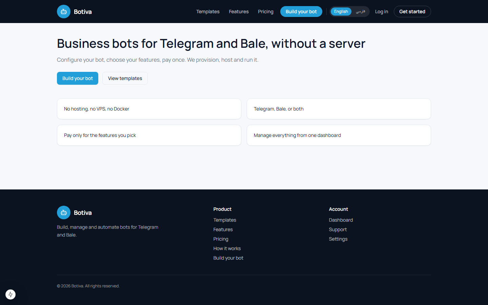
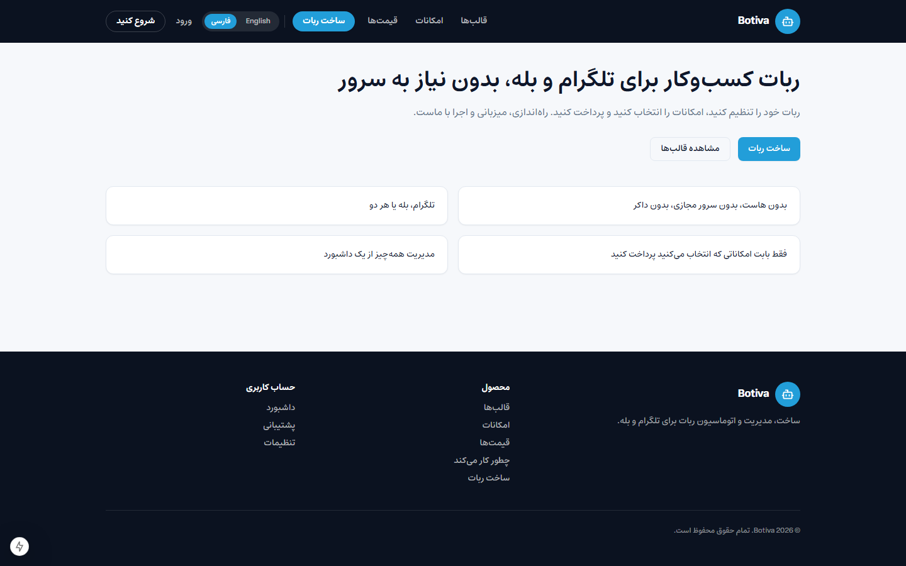
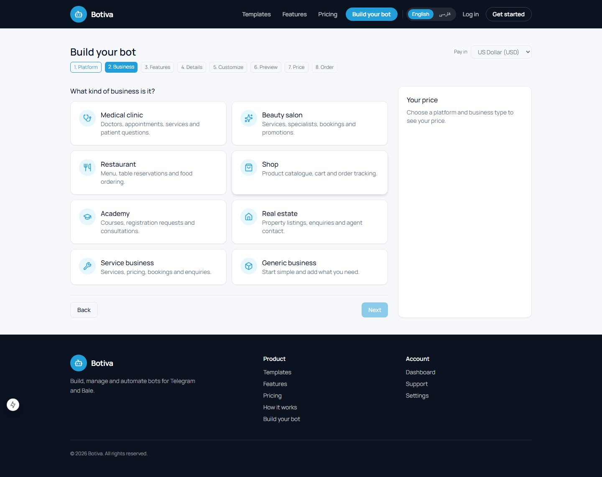
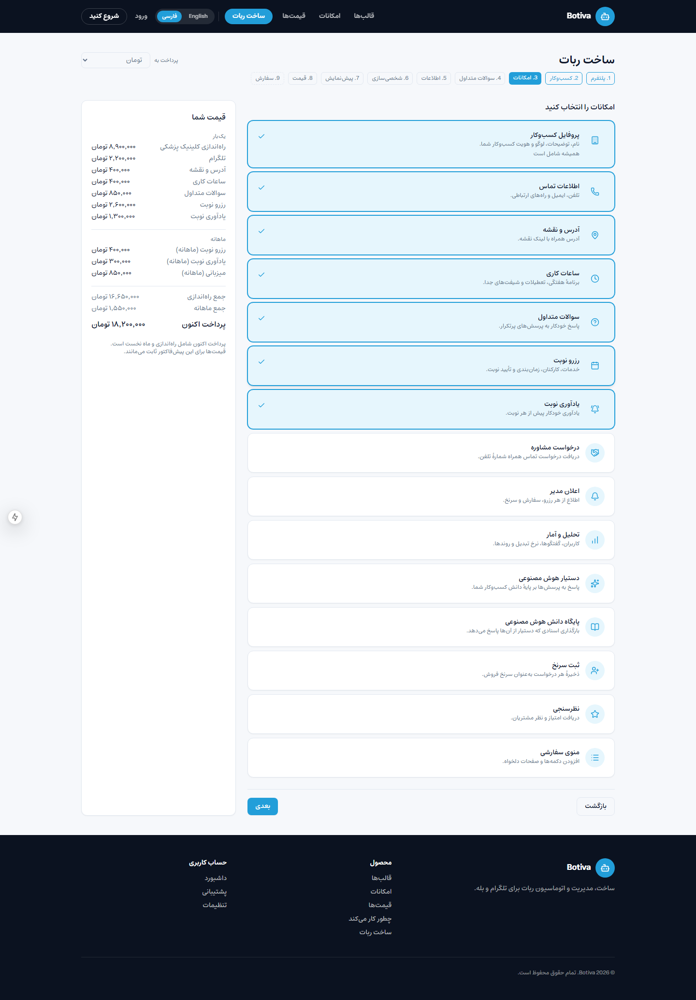
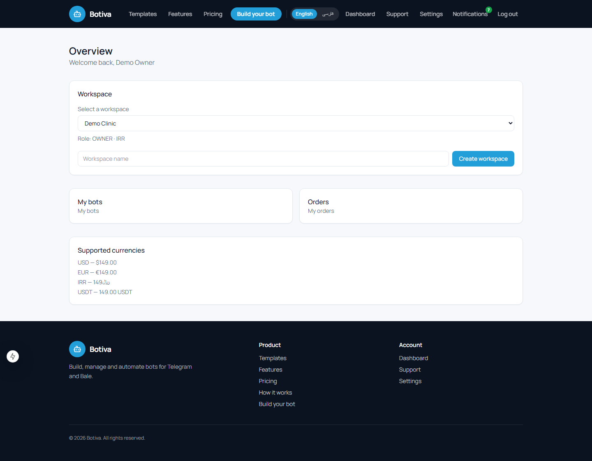
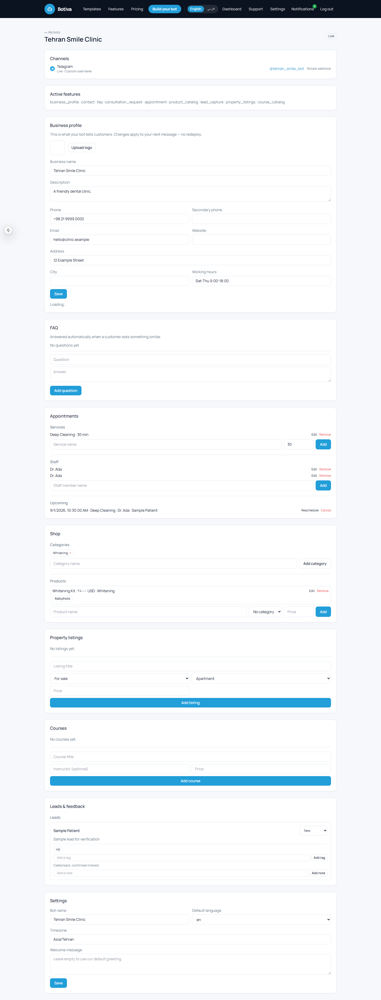

# Botiva

**Build a business bot for Telegram and Bale without touching a server, a webhook, or a
line of code.**

Botiva is a multi-tenant Bot-as-a-Service platform. A customer picks a business type
(clinic, restaurant, shop, real estate, academy, and more), chooses the features they
want, pays once, and the platform provisions, configures, hosts, and runs the bot for
them — on Telegram, Bale, or both at the same time, from one shared configuration.

This repository is the **entire product**: a Django/DRF backend, a Next.js frontend, the
Telegram and Bale bot runtimes, and everything in between.

<p align="center">
  
</p>

---

## Table of contents

- [What it actually does](#what-it-actually-does)
- [A tour, in screenshots](#a-tour-in-screenshots)
- [How it fits together](#how-it-fits-together)
- [Everything a bot can do](#everything-a-bot-can-do)
- [Tech stack](#tech-stack)
- [Running it yourself](#running-it-yourself)
- [Repository layout](#repository-layout)
- [Testing](#testing)
- [Deeper documentation](#deeper-documentation)
- [License](#license)

---

## What it actually does

Picture a small clinic that wants a Telegram bot for booking appointments and answering
FAQs, and a shop that wants a catalogue-and-checkout bot on Bale. Neither owner knows what
a webhook is, and neither should have to. Botiva turns "I want a bot that does X" into a
real, running bot in minutes:

1. **Configure** — pick a platform (Telegram, Bale, or both), a business type, and the
   features you want. Every feature that needs real content (FAQ answers, property
   listings, course details, ...) asks for it right there, in a form shaped for that
   exact feature — not a generic textbox.
2. **See the price** — an itemised quote, live, in your own currency. Toman for Iranian
   customers, USD internationally — no surprise conversions.
3. **Pay** — card transfer or crypto. Upload a receipt; staff review and approve it.
4. **It gets built** — the moment payment is approved, a background process creates the
   bot, applies your configuration, registers commands, sets the webhook, and runs a
   smoke test before calling it live.
5. **Manage it** — a dashboard for the heavy lifting (branding, working hours, catalogue,
   staff, leads), and a matching admin menu **inside the bot itself** for the day-to-day
   stuff, so an owner never has to leave the chat to answer a quick question.

The same idea works in reverse, too: a customer can skip the website entirely and order
a **brand-new bot by chatting with Botiva's own Telegram/Bale bot** — pick a template,
answer a few questions, pay, done.

## A tour, in screenshots

These are real, live screenshots of the app running locally — not mockups.

**The landing page, in Persian** — full right-to-left layout, the Estedad typeface, and
prices shown in Toman the instant the language switches, not after a buried settings
step.

<p align="center">
  
</p>

**Picking a business type** — every template carries its own icon and description, so
the builder reads as a real product, not a bare list.

<p align="center">
  
</p>

**Choosing features, priced live, fully in Persian** — every line in the price box is
translated, not just the currency: feature names, platform names, and the template
itself all switch language together.

<p align="center">
  
</p>

**The customer dashboard** — workspaces, bots, orders, and account settings in one place.

<p align="center">
  
</p>

**A live bot's management panel** — business profile, FAQ, appointments and staff,
product/property/course catalogues, leads, and settings, all editable without
redeploying anything.

<p align="center">
  
</p>

## How it fits together

```
   Website  ·  Telegram builder bot  ·  Bale builder bot
                         │
                  same REST API, same rules
                         ▼
     Quote  →  Order  →  Manual payment  →  Staff approval
                         ▼
               Provisioning saga (background)
                         ▼
         ┌───────────────┴───────────────┐
    Telegram bot                      Bale bot
         └───────────────┬───────────────┘
                         ▼
           one shared configuration
           one business database
```

A purchase creates **rows, not a codebase.** One engine serves every customer's bot —
adding a feature or a business template is a data change, not a new deployment. The two
chat platforms are genuinely different (Bale is not "Telegram with a different logo"),
so every capability is negotiated per platform and degrades explicitly instead of
silently assuming parity.

## Everything a bot can do

Botiva ships around 25 independent, individually-priced features, mixed and matched per
business type:

- **Core** — business profile & branding, contact details, location & map, structured
  working hours, a custom menu.
- **Customer interaction** — FAQ (answered automatically), a contact/message form,
  consultation requests, feedback & ratings.
- **Appointments** — services, staff, real-time slot availability, booking,
  rescheduling, cancellation, and automatic reminders.
- **Commerce** — product catalogue with photos and categories, cart & checkout, table
  reservations, food ordering, **property listings** (real estate) and **course
  offerings** (academy) as their own first-class content types, not a generic product
  stretched to fit.
- **CRM** — lead capture, notes, tags, a pipeline, customer broadcasts.
- **AI** — an assistant that answers from the business's own knowledge base.
- **Analytics** — usage and conversation metrics per bot.
- **Owner tools** — an in-chat admin menu (recent leads, today's appointments, quick FAQ
  edits) unlocked by linking a Telegram/Bale account to the dashboard once, and a
  chat-native ordering flow for building an entirely new bot without ever opening the
  website.
- **Telegram Mini App** — a storefront/booking surface inside Telegram itself, secured
  by Telegram's own signed `initData`, no separate login required.

## Tech stack

| Layer | Technology |
|---|---|
| Backend | Python 3.12, Django 5.2, Django REST Framework |
| Database | PostgreSQL 16 |
| Cache / queue | Redis 7, Celery 5 |
| Frontend | Next.js 15, React 19, TypeScript, Tailwind CSS |
| Fonts | [Manrope](https://fonts.google.com/specimen/Manrope) (Latin), [Estedad](https://fonts.google.com/specimen/Estedad) (Persian) — both self-hosted, no third-party font CDN at runtime |
| Bots | Telegram Bot API, Bale Bot API, a shared platform-adapter layer |
| Infra | Docker Compose for local development |

## Running it yourself

You'll need Docker Desktop, Python 3.12, and Node 20+.

```bash
git clone https://github.com/Erfaani/multi-platform-bot-builder.git
cd multi-platform-bot-builder

cp .env.example .env          # fill in every CHANGE_ME — see SECURITY.md before deploying anywhere real
docker compose up -d --build
docker compose exec backend python manage.py migrate
docker compose exec backend python manage.py seed_demo --demo
docker compose exec backend python manage.py seed_catalogue
```

That gives you a demo login (`owner@example.com` / `ChangeMe!2026`, **local development
only** — the seed command prints its own warning about this) and a full catalogue of
templates and features to build with. Backend on `:8000` (`/api/v1/docs/` for the API
schema), frontend on `:3000`.

Webhooks need a public HTTPS tunnel to actually receive Telegram/Bale traffic; without
one, set `BOT_RUNTIME_MODE=polling` and the bots still work locally.

### Running the backend outside Docker

```bash
python -m venv .venv && .venv/Scripts/pip install -r backend/requirements/local.txt
docker compose up -d postgres redis
cd backend && python manage.py migrate && python manage.py runserver
```

### A couple of things that will save you time

- **A native PostgreSQL/Redis install shadows the container.** If you already run
  Postgres or Redis locally, the containers can end up listening behind them, and you'll
  see a confusing `password authentication failed` even though the container itself is
  healthy. `POSTGRES_HOST_PORT` / `REDIS_HOST_PORT` in `.env` let you move the container's
  published port instead of fighting the collision.
- **Don't run a production build next to a live dev server.** `next build` and
  `next dev` sharing the same `.next/` directory corrupts the dev server's webpack
  manifest (`MODULE_NOT_FOUND` errors on pages that were working a minute ago). If that
  happens, stop the dev server, delete `.next/`, and restart it.
- **On Windows, write `.env` without a BOM.** `django-environ` rejects a byte-order-mark
  on the first line; PowerShell's `Set-Content -Encoding utf8` adds one by default. Use
  `-Encoding ascii` or a plain editor instead.
- **Tests need their own database URL:**
  ```bash
  TEST_DATABASE_URL=postgres://botbuilder:<password>@localhost:5432/botbuilder \
    python -m pytest tests
  ```

## Repository layout

```
backend/
  config/                 Django project: split settings, urls, celery
  apps/
    core/                 base models, money, encryption, outbox, errors
    accounts/              users, auth, staff RBAC
    customers/              tenants, memberships, roles, cross-channel identity linking
    businesses/            business profiles, hours, branding, FAQ
    business_templates/     clinic, restaurant, shop, real estate, academy, …
    features/               feature catalogue + manifests (the "what can a bot do" registry)
    pricing/                price lists, immutable price versions, quote engine
    orders/                quotes, orders, the order state machine
    payments/               methods, payments, receipts, providers
    bots/                   bots, platform instances, credentials, configuration
    provisioning/           the saga that turns a paid order into a live bot
    bot_runtime/            webhook ingress, dispatch, conversation sessions, outbound gateway
    platforms/              adapter registry + telegram/ bale/ preview/
    appointments/ commerce/ crm/    business modules (booking, catalogue, leads)
    bot_admin/              the in-chat owner admin menu
    bot_builder/            chat-native bot ordering (Botiva's own builder bot)
    miniapp/                Telegram Mini App backend (initData verification + API)
    notifications/ analytics/ support/ subscriptions/ ai/ audit/ i18n_content/
  requirements/  locale/  tests/
frontend/                  Next.js app (App Router, TypeScript, Tailwind)
docker/                    Dockerfiles, nginx, postgres init
docs/                       architecture notes, ADRs, screenshots
```

## Testing

```bash
cd backend
TEST_DATABASE_URL=postgres://botbuilder:<password>@localhost:5433/botbuilder \
  python -m pytest -p no:randomly
```

The suite covers the full order lifecycle, multi-platform bot provisioning against a
fake transport (never a real Telegram/Bale API call), the conversation state machine for
every business module, and every locale-sensitive rendering path — prices, dates,
currencies, RTL.

## Deeper documentation

The technical documents this project was built against are still here, and still
accurate:

| Document | What it answers |
|---|---|
| [ARCHITECTURE.md](ARCHITECTURE.md) | Layering, app boundaries, adapters, feature manifests |
| [DATABASE.md](DATABASE.md) | ERD, tables, constraints, indexing |
| [API.md](API.md) | Endpoint contract, error format, conventions |
| [SECURITY.md](SECURITY.md) | Tenancy isolation, credential handling, uploads, audit |
| [I18N.md](I18N.md) | fa/en, RTL, Jalali dates, Toman vs IRR |
| [PAYMENTS.md](PAYMENTS.md) | Money representation, pricing engine, manual card & crypto |
| [BOT_RUNTIME.md](BOT_RUNTIME.md) | Webhook ingress, dispatch, sessions, outbound gateway |
| [TELEGRAM.md](TELEGRAM.md) | Telegram limits and the provisioning problem |
| [BALE.md](BALE.md) | Bale differences and the required capability spike |
| [DEPLOYMENT.md](DEPLOYMENT.md) | Services, topology, migrations, backups |
| [RUNBOOK.md](RUNBOOK.md) | Operational playbook: incidents, retries, recovery |
| [PHASES.md](PHASES.md) | The build's phase-by-phase history |

Four decisions worth knowing before you read the code:

1. **Bots cannot be created via API.** Neither Telegram nor Bale offers that. Provisioning
   uses a pre-created bot pool (instant, generic username) or a guided token handoff
   (the customer's own username, token surrendered once and never shown again).
2. **Bale is not Telegram.** Adapters negotiate capabilities and degrade explicitly —
   there is no shared inheritance and no assumed parity between the two platforms.
3. **Prices are immutable versions.** Changing a price closes a row and inserts a new
   one, so an order placed two years ago still renders exactly as it was purchased.
4. **Money is an integer minor unit plus a currency code.** Toman is a *display unit* of
   the Iranian Rial, not a currency of its own — conflating the two is a tenfold billing
   error waiting to happen.

## License

**All rights reserved.** This repository is public so the code can be read and reviewed,
but no license is granted to use, copy, modify, merge, publish, distribute, sublicense,
deploy, or sell any part of it, in whole or in part, for any purpose. See
[LICENSE](LICENSE) for the exact terms.

If you'd like to use this project or its code for something, reach out first.

---

Built by [Erfan Jouybar](https://github.com/Erfaani).
